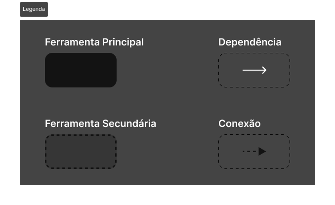

# Diagrama de Soluções

## Introdução
Considerando o objetivo amplo da dor que esta solução busca resolver, este trecho da documentação tem como propósito expor, a estrutura e as inter-relações entre os domínios da plataforma, destacando como cada um contribui para o funcionamento do sistema.

Para melhor aproveitamento dessa documentação acesse o figma do projeto pelo link a seguir: [Estruturação de Negócio - FIGMA](https://www.figma.com/design/dnBqepKRepi4wqaEI2k5nA/Negócio?node-id=8-4&p=f&t=XdYzO5pRCfeSlNEh-0)

## 1. Legenda
A legenda define a simbologia usada nos diagramas:

- **Ferramenta Principal**: Representada por um retângulo preto sólido. Tem o objetivo de armazenar as funções fundamentais do domínio.
- **Ferramenta Secundária**: Representada por um retângulo com borda tracejada. Seu objetivo é armazenar ações não essências do domínio.
- **Dependência**: Indicada por uma seta branca conectando módulos, sendo dependênte o módulo de onde a seta parte.
- **Conexão**: Indicada por uma seta pontilhada conectando módulos. Essa conexão é dada pelo envio de informação, partindo da origem da seta.

## 2. Domínios e Ferramentas
Este diagrama apresenta os módulos principais do sistema, organizados em três grandes domínios:

### **PDV (Ponto de Venda)**
Responsável pela gestão direta das transações comerciais, utilizando as seguintes ferramentas:
- **Cadastro de Grupos**
- **Cadastro de Produtos**
- **Registro de Vendas**
- **Relatório do Caixa** (Ferramenta Secundária)
- **Relatório de Produto** (Ferramenta Secundária)

### **Finanças**
Oferece uma visão detalhada da saúde financeira da empresa, por meio das seguintes ferramentas:
- **Contas a Pagar**
- **Contas a Receber**
- **Fluxo de Caixa**
- **DRE** (Ferramenta Secundária)

### **Clientes**
Foca no fortalecimento do relacionamento com os clientes, utilizando as seguintes ferramentas:
- **Cadastro de Clientes**
- **Cadastro de Cupons**
- **Gerenciamento de Fidelização**
- **Acompanhamento do Cliente** (Ferramenta Secundária)

## 3. Dependências
Este diagrama mostra a dependência entre as ferramentas do sistema.

### **PDV**
- **Cadastro de Produtos** depende do **Cadastro de Grupos**.
- **Registro de Vendas** depende do **Cadastro de Produtos**.
- **Relatório do Caixa** está ligado ao **Registro de Vendas**.
- **Relatório de Produto** está ligado ao **Cadastro de Produtos**.

### **Finanças**
- **Fluxo de Caixa** depende de **Contas a Pagar** e **Contas a Receber**.
- **DRE** depende do **Fluxo de Caixa**.

### **Clientes**
- **Gerenciamento de Fidelização** depende do **Cadastro de Clientes** e do **Cadastro de Cupons**.
- **Acompanhamento do Cliente** depende do **Gerenciamento de Fidelização**.

## 4. Conexões Entre Domínios
Este diagrama apresenta as conexões entre diferentes domínios do sistema:
- **Ferramenta Cadastro de Cupons** está conectada por uma linha tracejada ao **Registro de Vendas**.
- **Registro de Vendas** está ligado ao **Fluxo de Caixa**.
- **Registro de Vendas** está conectado ao **Gerenciamento de Fidelização**.

